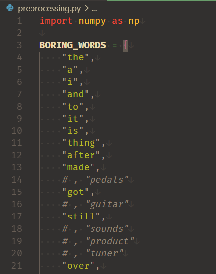

# Word2Vec in NumPy
This project is a numpy implementation of the Skip-Gram Negative Sampling training loop for Word2Vec.

# How to run
The entrypoint of the project is ```main.py```. 

The codebase imports ```numpy``` and ```matplotlib```. 

Using the uv package manager [by Astral](https://docs.astral.sh/uv/getting-started/installation/), easily run the project by executing CLI commands in project root:

1. ```uv sync``` to create a virtual environment with packages **matplotlib** and **numpy**.
2. ```uv run main.py``` to run the project with the created virtual environment.
   
# Basic concept of Word2Vec
The goal of Word2Vec is to learn high-dimensional vector embeddings of words, such that the the orientation encodes the meaning. To illustrate, a classic example is: 

```V("Queen") = V("King") - V("Man") + V("Woman")```

Where V(word) represents the vector embedding of word.

## Neural network
The skip-gram word2vec's model can be seen as a shallow neural network with the following data flow.
- one-hot inputs
- linear combination with word2vec matrix as weights
- linear combination with vec2context matrix as weights
- softmax probabilities for each class.

This differs from the code implementation because negative sampling is faster.
<!-- In implementation this is usually done with negative sampling:
1. Simply selecting the correct word2vec embedding instead of matrix multiplication with one-hot vectors
2. Replacing the expensive softmax with  -->

# Features
- Persisting the trained models in storage
  - By default, training will write the trained embeddings to storage and run statistics on them.
  - This allows reusing trained embeddings when experimenting with applications of embeddings (like statistics/analysis)
- Persisting samples in storage
  - Lazy reading the dataset from storage
  - Lazy writing train samples to storage
  - Lazy reading train samples from storage during training (constant space complexity w.r.t. dataset size)
  - My hardware could have allocated this relatively small dataset entirely, but if the dataset were larger this ad hoc approach would scale very well.
- Negative sampling
  - We can approximate the gradient of the expensive softmax by computing the gradient of a batch of 1 positive + k negative (target, context, label) tuples.
  - Negatives are drawn from a unigram distribution of the non-target words' frequencies (slightly smoothened with **(3/4))
  - Adding the label to the tuple allowed me to implement the forward pass to be agnostic of whether the context word is positive or negative. 
  - This means that many batches can be appended to one another to perform batch processing of n positive samples + k*n negative samples as a future feature.
- Semantically redundant and dominating words like "the" are removed to reduce computation overhead of learning more interesting words. 
  - I put the dataset's 120 most occurring stop-words in a constant set to filter out and manually removed interesting words like "guitar". 
  - They are filtered during both vocabulary building and sampling. 
  - Removing boring words at tokenisation time alone, will result in skip gram samples being sourced outside the context size.
  - To illustrate, removing "the" at tokenization time would convert "I love the harmonious violin" into "I love harmonious violin", which will then lead sampling to falsely associate "love" with "harmonious"

## Project Structure
For the sake of seperation of concerns/code cleanliness, the logic is split into several noteworthy files:
- `main.py`: Entry-point of the project in which you can train Word2vec.
- `dataset_loading.py`: Read dataset (lazily for memory scalabilty)
- `preprocessing.py`: Prepare dataset for training (tokenisation, cleaning, removing meaningless words) Text cleaning, vocabulary building, unigram distribution, and positive pair generation
- `network.py`: Training logic (forward pass, gradient descent)
- `analysis.py`: Analysis methods for verifying the learned embeddings.
- `Musical_Instruments_5.json`: 5-core Amazon reviews sample (input data)

## Hyperparameters

Hyperparameters can be adjusted in `main.py`
- `n_lines`: amount of reviews to read from the dataset.
- `context_size`: amount of context words before and after target to sample from.
- `neg_per_pos`: amount of negative samples per positive sample
- `n_epochs`: amount of times to train on the same reviews.
- `learning_rate`: the magnitude of the step in gradient descent's loss landscape

## Dataset
- [Amazon Product Reviews (Musical Instruments)](https://nijianmo.github.io/amazon/index.html)
